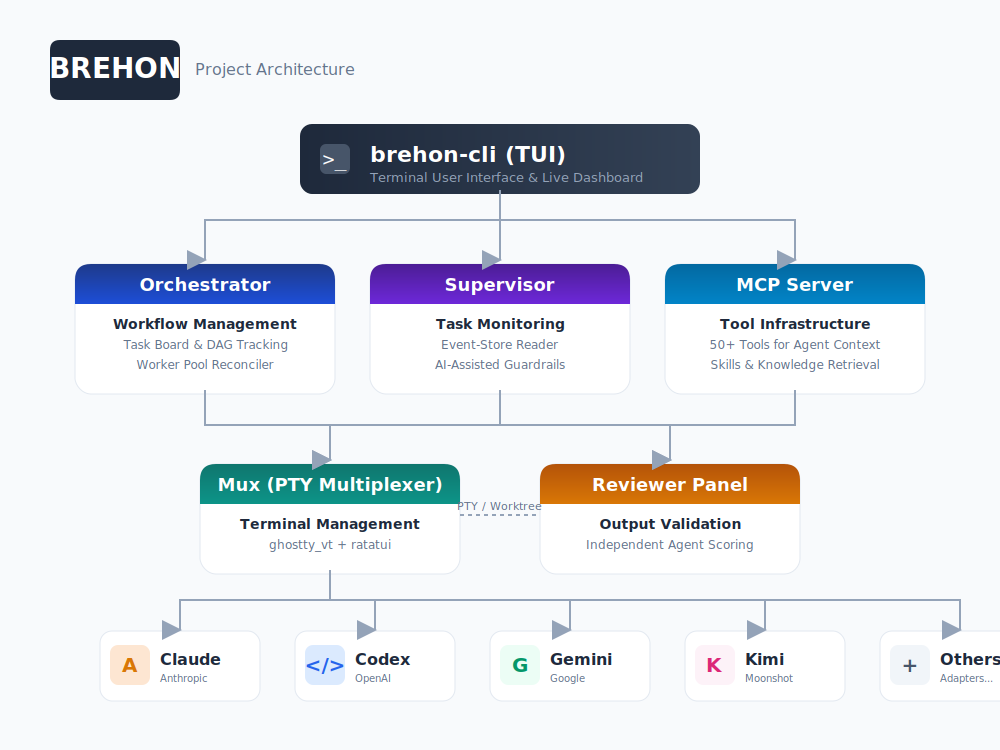

# Brehon

**A local-first orchestrator for panels of AI coding agents — judged by panels of other AI agents.**

[](LICENSE)

---

In early Irish law, a **brehon** (*breithem*) was a professional judge who decided
disputes by panel — weighing arguments, applying precedent, and issuing binding
verdicts whose weight depended on the standing of each judge on the bench.
This project does the same for your codebase.

Workers (AI coding agents — Claude Code, Codex, Gemini CLI, OpenCode, and others)
implement tasks in isolated git worktrees. When work is ready, it is sent to a
**panel of reviewer agents** who independently score it against a policy. If the
panel's collective verdict clears the threshold, the work merges. If not, it goes
back for another round, with the same panel — bound to the task — preserving
context across revisions.

A lightweight Rust supervisor watches the whole process by reading an event store.
Tokens are only spent when human-style judgment is needed; everything else is
free deterministic logic.

## Heads up before you dive in

- **This is something I built around my own workflow.** It's the fifth
  internal rewrite of this idea. I've been running the current version 24/7
  for weeks, and lived on earlier iterations for months before that — under
  a different name, since I renamed the project right before open-sourcing it.
  Long story short: it works for me, and it's been hammered on enough that
  the obvious bugs are out. But the *shape* of it — the lane model, the
  panel-judges-panel structure, the assumptions about how a session flows —
  was tuned to how I work. It might be a perfect fit for you, it might be
  ridiculous overkill, it might be subtly wrong for your style. Treat this
  repo as a data point. I'm publishing it because the design choices might
  be useful to look at, not because I'm claiming it's the way to do this.
- **It can be expensive.** A panel of N reviewers means every "ready for
  review" event triggers N independent agent calls, each of which reads the
  diff and may pull in surrounding context. Multiply by retry rounds, multiply
  again if your worker lane is also a paid model. A long session with three
  reviewers and a couple of revision rounds can burn through tokens fast.
  The `brehon-supervisor` tracks budgets and the config lets you cap rounds
  and panel size, but the defaults are tuned for *quality of verdict*, not
  for thrift — turn the dials down before you turn it loose on a real epic.

## What's in the box

This is a 36-crate Rust workspace (~230k LOC, 1,100+ tests) implementing:

- A **task orchestrator** with a kanban-style board, dependency DAG, and worker pool
  reconciliation (`brehon-orchestrator`).
- A **Rust-native supervisor** that consumes an append-only event store, detects
  stuck workers, tracks token budgets, and escalates when necessary
  (`brehon-supervisor`).
- A **reviewer-panel coordinator** with score collection, threshold evaluation,
  feedback consolidation, panel affinity, and stale-detection (`brehon-review`).
- An **MCP server** exposing 50+ tools for agent coordination, memory, rules, skills,
  task management, verification, and factory control (`brehon-mcp`).
- A **PTY-based terminal multiplexer** with embedded terminal emulation (via the
  vendored ghostty VT) and a full ratatui dashboard (`brehon-mux`, `brehon-tui`).
- A **persistent event store** on fjall (LSM-tree) with full-text search over
  memories/rules/skills via tantivy (`brehon-store-fjall`, `brehon-search-tantivy`).
- A **worktree-per-worker** git layer with recovery for stale lockfiles and
  mid-operation states (`brehon-git`).
- Nine **agent adapters** covering Claude Code, Codex, Gemini, GitHub Copilot,
  Kimi, JetBrains Junie, OpenCode, OpenAI HTTP, and a native ACP client.

See [docs/ARCHITECTURE.md](docs/ARCHITECTURE.md) for a full walkthrough and the
[Architecture Decision Records](docs/adr/) for the reasoning behind each major
choice.

## How a session runs



1. `brehon run` loads config, opens the fjall event store, and reconciles any
   in-flight state from the previous session.
2. The orchestrator computes the task DAG and assigns ready tasks to workers
   based on lane configuration.
3. Each worker gets its own git worktree under `.brehon/worktrees/<worker-id>/`.
   No two workers can step on each other.
4. Workers are spawned as PTY processes inside the mux. The TUI shows their
   live terminals; agents talk to the MCP server for shared context.
5. When a worker reports a task ready, the verification tool spawns a
   **reviewer panel** from configured reviewer lanes.
6. Each reviewer scores the work 1–10, attaches structured findings
   (blocking / suggestion / nitpick), and submits independently.
7. The score collector applies the policy: minimum average, minimum individual
   score, no blocking findings, minimum approval count. If met, the supervisor
   integrates the work via git cherry-pick to the epic branch.
8. If not met, the same panel is bound to the task for the next round.
   The policy caps rounds before escalation to a human supervisor.

## Prerequisites

- **Rust** 1.75 or later. Install via [rustup](https://rustup.rs/).
- **Zig** 0.13 (only required if you are building the vendored ghostty
  terminal-emulation bindings from source; pre-built artifacts cover most users).
- **Git** 2.x with worktree support (any modern version).
- At least one supported agent CLI installed:
  Claude Code, Codex, Gemini CLI, OpenCode, Kimi, JetBrains Junie, or GitHub Copilot CLI.
  You can also point Brehon at any OpenAI-compatible HTTP endpoint via the
  `brehon-adapter-openai` adapter.

## Build

```bash
git clone https://github.com/VerifiedOrganic/brehon.git
cd brehon
git submodule update --init --recursive   # vendored ghostty
cargo build --release
```

The binary is built at `target/release/brehon`. Copy it onto your `PATH`:

```bash
install -m 0755 target/release/brehon ~/.local/bin/brehon
```

## Quickstart

```bash
# Initialize Brehon state inside your project repo
cd /path/to/your/project
brehon init

# Load a plan document into the task board.
# (See "Loading a plan" below for what PLAN.md needs to look like
# and why this is split into two commands.)
brehon extract-plan PLAN.md --output .brehon/plan.json
brehon import-plan .brehon/plan.json

# Run the orchestrator with the default configuration
brehon run

# Or invoke the MCP server only (for use from another agent)
brehon serve

# Inspect runtime state / dashboard
brehon runtime dashboard

# Diagnose missing agents, malformed config, broken worktrees, etc.
brehon doctor
```

If you don't have a plan document yet and just want to drive Brehon via an
external agent talking to its MCP server, you can skip the extract/import
steps — `brehon run` will spin up with an empty board, and tasks can be
created through the MCP `task` tool.

## Loading a plan

The realistic on-ramp into Brehon is a **plan document** — a structured
description of the work, broken into phases, epics, and concrete tasks with
dependencies, sizes, and gate conditions. Without one, the orchestrator has
nothing to dispatch (other than what an external agent pushes in over MCP),
so for most users this is the first real step after `brehon init`.

Two commands handle plan ingestion. They share extraction logic and a
`--mode` flag, but split *what they do with the result*:

- **`brehon extract-plan FILE`** — Parse or LLM-extract a plan document into
  a normalized JSON form. Prints to stdout by default, or to `--output PATH`.
  Does **not** touch the task board.
- **`brehon import-plan FILE`** — Take a plan (either the original source
  document, or already-extracted JSON) and create the corresponding
  `initiative → phase-epics → tasks` tree on the task board, including the
  final hardening epic. Use `--dry-run` to preview what would be imported
  without writing anything.

### The three extraction modes

| Mode | What it does | When to use |
| ---- | ------------ | ----------- |
| `direct` | Parse the markdown directly with Brehon's built-in parser. Deterministic, free, instant. | Your plan already follows the structure below. |
| `supervisor` | Feed the document to the configured supervisor lane's CLI (claude / codex / gemini / opencode) under a JSON schema, and let it normalize the result into a `PlanDocument`. **This is the expensive path** — at minimum one LLM call, often one per phase or even per task for chunkable documents. | Your plan is free-form, hand-written, or follows a different convention. |
| `auto` (default) | Try direct first; fall back to supervisor only if direct parsing fails. | You don't know which one applies and want the cheapest viable option. |

The supervisor mode reads the supervisor lane out of `.brehon/config.yaml`
and requires it to be an ACP-style subprocess launcher (`claude`, `codex`,
`gemini`, or `opencode`). If the supervisor lane is configured differently,
the command will refuse rather than silently change behavior.

Timeouts are tunable via env vars: `BREHON_PLAN_EXTRACT_IDLE_TIMEOUT_SECS`
(how long the extractor may go silent before being killed) and
`BREHON_PLAN_EXTRACT_MAX_TIMEOUT_SECS` (wall-clock ceiling). The legacy
single-value `BREHON_PLAN_EXTRACT_TIMEOUT_SECS` is still honored for
back-compat.

### The recommended pattern: extract once, import many times

```bash
# One expensive LLM pass to normalize a free-form plan into JSON.
brehon extract-plan PLAN.md --mode supervisor --output .brehon/plan.json

# Review or hand-edit .brehon/plan.json if you want — it's a checked-in
# artifact you can keep alongside the source markdown.

# Cheap, deterministic, re-runnable import from the normalized form.
brehon import-plan .brehon/plan.json
```

This split is the main reason both commands exist. Extraction over an LLM
can take minutes and cost real money; you don't want to redo it every time
you tweak something. The normalized JSON is the cache.

### What the direct parser expects

If you want to skip the LLM and use `--mode direct`, your markdown needs to
look like this (slightly simplified — see
`crates/brehon-cli/src/commands/import_plan/tests.rs` for canonical
examples):

```markdown
# My Plan Title

**Project:** My Project
**Stack:** Rust + Tokio
**Target:** Linux x86_64

## Phase 1: Foundations

### Phase 1.1: Wire up the storage layer

| ID    | Title                    | Dependencies | Size | Gate          | Status |
| ----- | ------------------------ | ------------ | ---- | ------------- | ------ |
| T-101 | Define event types       |              | S    | unit tests    | Open   |
| T-102 | Implement append path    | T-101        | M    | smoke test    | Open   |

### Phase 1 gate: Tests and acceptance

| ID    | Title              | Dependencies | Size | Gate        | Status |
| ----- | ------------------ | ------------ | ---- | ----------- | ------ |
| T-1G  | Phase 1 sign-off   | T-101,T-102  | S    | all pass    | Open   |
```

If your existing plan format is close but not identical, run `extract-plan`
with `--mode supervisor` once, save the JSON, and import from there.

## Configuration

Configuration lives at `.brehon/config.yaml`. The default schema (see
`crates/brehon-config/src/defaults.yaml` for the full version) is built
around two concepts:

- **Launchers** — how to spawn a particular agent CLI. Each launcher specifies
  the adapter (`Acp` or `NativeHooks`), the command, and arguments.
- **Lanes** — named bundles of launcher + model + system prompt. Workers,
  supervisors, and reviewers are assigned to lanes, not directly to launchers.

Example excerpt:

```yaml
version: 1

launchers:
  claude:
    adapter: NativeHooks
    command: claude
  codex:
    adapter: Acp
    command: codex
    args: ["app-server"]
  gemini:
    adapter: Acp
    command: gemini
    args: ["--acp"]

lanes:
  claude-supervisor:
    launcher: claude
    model:
      provider: anthropic
      name: claude-sonnet-4-6
  codex-worker:
    launcher: codex
    model:
      provider: openai
      name: gpt-5.3-codex
  claude-reviewer:
    launcher: claude
    model:
      provider: anthropic
      name: claude-opus-4-6
    system_prompt: |
      You are a reviewer. Your job is to evaluate submitted work,
      not to implement it.
```

The supervisor, worker pool sizing, reviewer panel composition, and review
scoring policy are all configured under their respective sections; see the
defaults file and the schema validator (`brehon-config/src/validate/`) for the
authoritative form.

## CLI Reference

| Command                       | Purpose                                                              |
| ----------------------------- | -------------------------------------------------------------------- |
| `brehon run [--workers SPEC]` | Start a full orchestration session (default subcommand).             |
| `brehon serve`                | Run the MCP server in stdio mode for use from an external agent.     |
| `brehon init [--path P]`      | Create `.brehon/` in a project directory with starter config.        |
| `brehon doctor`               | Check that required CLIs, git, and config are healthy.               |
| `brehon config <subcmd>`      | Inspect, validate, or merge config files.                            |
| `brehon test [--live]`        | Run scenario tests; `--live` exercises real agents.                  |
| `brehon runtime <subcmd>`     | Inspect runtime state (dashboard, events, panes).                    |
| `brehon ps` / `brehon kill`   | Process inspection for in-flight runs.                               |
| `brehon task <subcmd>`        | Direct task-board operations (list, get, transition).                |
| `brehon factory <subcmd>`     | Factory-mode worker lifecycle.                                       |
| `brehon extract-plan FILE`    | Normalize a plan document into JSON (direct parse or LLM-extract).   |
| `brehon import-plan FILE`     | Import a plan (markdown or normalized JSON) into the task board.     |
| `brehon process <subcmd>`     | Low-level process control.                                           |
| `brehon reset`                | Reset runtime state. Guarded against destroying `main`/`master`.     |
| `brehon clean`                | Clean up stale worktrees and runtime directories.                    |
| `brehon epic-truth`           | Report the current epic-branch ground truth.                         |

Use `brehon <cmd> --help` for the full flag set of each subcommand.

## MCP integration

Brehon ships as an MCP server. Once installed, point any MCP-capable agent at it
using a config like:

```json
{
  "mcpServers": {
    "brehon": {
      "command": "brehon",
      "args": ["serve"]
    }
  }
}
```

See `.mcp.json.example` in this repo for a copy-pasteable starting point.
The tools currently exposed include `agent`, `advisor`, `health`, `research`,
the `*_memory` family, `*_rule` family, `search_skills`, the `*_task` family,
`verification`, plus factory, git-cherry-pick, context-efficiency,
proof-summary, stability, and routing tools.

## Repository layout

```
crates/
  brehon-types         core domain types and event shapes
  brehon-ports         port traits (hexagonal seam)
  brehon-config        YAML schema, loading, validation
  brehon-orchestrator  task board, DAG, worker pool, reconciler
  brehon-supervisor    event-store monitor, stuck detection, budget tracking
  brehon-review        panel, scoring, thresholds, consolidation
  brehon-runtime       in-process event bus
  brehon-workflow      audited dry-run workflow primitives
  brehon-policy        runtime policy gates
  brehon-detect        pattern-based output anomaly detection
  brehon-protocol      factory client/server wire format
  brehon-daemon        sidecar daemon process
  brehon-gatekeeper    epic-level preflight gating
  brehon-host          experimental terminal-host abstraction
  brehon-acp           Agent Communication Protocol (stdio)
  brehon-mcp           Model Context Protocol server (50+ tools)
  brehon-store-fjall   persistent event store (LSM)
  brehon-search-tantivy full-text index for memories/rules/skills
  brehon-git           worktree + branch + cherry-pick operations
  brehon-mux           in-process PTY multiplexer
  brehon-pty           PTY process spawning
  brehon-tui           ratatui dashboard and panes
  brehon-recording     terminal session recording
  brehon-doctor        diagnostics
  brehon-adapter-sdk   shared adapter trait + helpers
  brehon-adapter-claude    Claude Code adapter (PTY-native hooks)
  brehon-adapter-codex     Codex adapter (websocket app-server)
  brehon-adapter-copilot   GitHub Copilot CLI adapter (ACP)
  brehon-adapter-gemini    Gemini CLI adapter (ACP)
  brehon-adapter-junie     JetBrains Junie adapter (ACP)
  brehon-adapter-kimi      Kimi Code adapter
  brehon-adapter-openai    OpenAI-compatible HTTP adapter
  brehon-adapter-opencode  OpenCode adapter
  brehon-native-agent      Brehon-native ACP runtime
  brehon-cli           command-line entry point (binary: brehon)
  brehon-test-harness  shared test fixtures
  ghostty_vt           vendored terminal-emulation bindings
docs/
  ARCHITECTURE.md      detailed system walkthrough
  adr/                 architecture decision records
```

## Development

```bash
cargo test --workspace                          # full test suite (~1,100 tests)
cargo test -p brehon-orchestrator               # one crate
cargo clippy --workspace --all-targets          # lints (warning-free required)
cargo fmt --all -- --check                      # formatting check
cargo doc --workspace --no-deps --open          # rustdoc
```

The test suite includes unit tests in each crate plus integration tests under
`crates/brehon-cli/tests/` (`scenarios_tests`, `chaos_tests`, `crash_tests`,
`soak_tests`, `stress_tests`, `epic_integration_tests`, `git_tests`,
`supervised_sidecar`, `review_flow`, and `doctor_integration`).

## Contributing

See [CONTRIBUTING.md](CONTRIBUTING.md).

This is pre-1.0 software. Crate boundaries, configuration shapes, and on-disk
formats may still change. Pin your version.

## License

[MIT](LICENSE)
