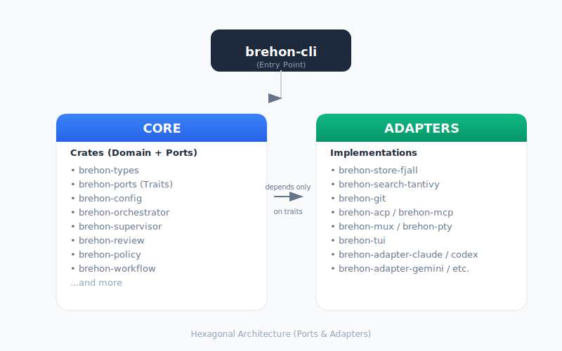

# Brehon Architecture

This document describes how Brehon is actually built. It tracks the code in
`crates/`. Where a claim is made about behavior, it is anchored to a file path
you can read yourself. Decisions are recorded individually under [`adr/`](adr/).

Audience: contributors and reviewers who need to understand the system at the
level required to make changes, debug a stuck run, or extend an adapter.

A note on provenance, because it affects how to read what follows: this is
the fifth internal version of this system. Most of the structural choices
here — the hexagonal seam, the append-only event store as the source of truth,
the panel-as-a-bound-unit, the worktree-per-worker discipline, the decision
to run everything in one process under one Tokio runtime — exist because
earlier versions tried the opposite and failed in specific ways. Where a
choice looks excessive, it usually isn't: it's repaying a debt from a
prior iteration. The ADRs under [`adr/`](adr/) capture those failures one
decision at a time. The current version has been running 24/7 on real work
for weeks; the obvious bugs are out, but the *shape* is still opinionated
and tuned to a specific way of working. Read accordingly.

---

## 1. One process, many components

Brehon runs as a single process: `brehon-cli` (binary name `brehon`). There is
no daemon, no background service, no orchestration sidecar. Everything the
system does — task assignment, supervision, review coordination, MCP serving,
PTY multiplexing, TUI rendering — happens inside one Tokio runtime, with
components communicating through in-process channels and a shared event store
on disk.

The process boundary is the unit of crash recovery. If `brehon run` exits,
the next invocation reconciles state from the event store under
`.brehon/store/` (see [§7](#7-recovery)).

The MCP server can also be run standalone via `brehon serve` for use as a
context provider by an external agent without spinning up the full
orchestrator.

---

## 2. Hexagonal layout

The codebase follows ports-and-adapters strictly. Core domain crates depend
only on trait definitions in `brehon-ports`; all I/O — storage, search, git,
agent communication, terminal control, notifications — is reached through
those traits. Adapter crates provide concrete implementations.



The ports defined in `crates/brehon-ports/src/` are:

| Port | File | Implementations |
| ---- | ---- | --------------- |
| `EventStore` | `event_store.rs` | `brehon-store-fjall` (only) |
| `RunStore` | `run_store.rs` | `brehon-store-fjall` |
| `ProofStore` | `proof_store.rs` | `brehon-store-fjall` |
| `SearchIndex` | `search_index.rs` | `brehon-search-tantivy` |
| `GitOperations` | `git_ops.rs` | `brehon-git` (libgit2) |
| `AgentGateway` | `agent_gateway.rs` | nine `brehon-adapter-*` crates |
| `DecisionEngine` | `decision.rs` | `brehon-supervisor` |
| `NotificationSink` | `notification.rs` | `brehon-tui`, `brehon-mux` |
| `RuntimeEventSink` / `Stream` | `runtime.rs` | `brehon-runtime` |
| `RuntimeCommandPort` / `Router` | `runtime.rs` | `brehon-mux` |
| `TerminalHostAdapter` | `runtime.rs` | `brehon-mux`, `brehon-host` |
| `PolicyGate` | (ports) | `brehon-policy` |
| `DetectionEngine` | (ports) | `brehon-detect` |

The hexagonal seam is enforced by Cargo dependencies: core crates do not
depend on adapter crates. Replacement is mechanical — write a new
`EventStore` implementation in a new crate and the rest of the system uses it
through the same trait. See [ADR-0001](adr/0001-rust-and-hexagonal.md).

---

## 3. Startup flow

The full `brehon run` path lives in `crates/brehon-cli/src/commands/run/`
(split across `mod.rs`, `setup.rs`, `workers.rs`, `review.rs`). The high-level
sequence:

1. **Parse CLI args** — `crates/brehon-cli/src/main.rs` uses `clap` to derive
   the `Commands` enum (see [§9](#9-cli-surface)).
2. **Resolve project root** — looks for `.brehon/` or a config file passed
   with `--config`.
3. **Load config** — `brehon-config` reads `.brehon/config.yaml`, merges
   layered overrides, validates against the schema in
   `brehon-config/src/validate/`.
4. **Prepare worktrees** — `setup::prepare_scoped_worktrees_with_progress()`
   calls `brehon_git::Git2Operations::create_worktree()` to create
   `.brehon/worktrees/<worker-id>/` per worker.
5. **Open event store** — `FjallEventStore::new(.brehon/store)` opens or
   creates the LSM-tree. On startup, a recovery scan reconstructs in-memory
   indexes and detects orphaned leases.
6. **Build reviewer panels** — `review::build_reviewer_panels()` and
   `build_planned_review_panel_seats()` materialize panel rosters from
   the reviewer lanes in config. `reconcile_review_runtime_for_run()`
   restores in-flight review state from disk.
7. **Spawn orchestrator** — `Orchestrator::new()` initializes the task board,
   the dependency DAG, and the worker pool. The reconciler thread starts
   polling for ready tasks.
8. **Spawn supervisor** — `Supervisor::new()` starts the event monitor,
   stuck detector, budget tracker, and nudge generator as a background
   `tokio::spawn` task. It only consumes events; it does not call agents
   on the hot path.
9. **Resolve worker adapters** — `resolve_worker_pool_counts()` reads
   role/lane mappings from config; `agent_to_adapter()` selects the right
   `brehon-adapter-*` for each lane.
10. **Start the mux and/or TUI** — depending on mode, either
    `run_tui_with_panels_and_runtime_commands()` (full dashboard) or a
    headless mux. The mux spawns each agent as a PTY process in its
    worktree.
11. **Wire the direct-tool bridge** — `BrehonDirectToolBridge` connects the
    MCP server's verification/task/factory tools to the runtime's command
    and event ports, so an agent calling `verification.request_review` from
    inside its session actually reaches `ReviewCoordinator`.
12. **Enter the runtime loop** — the TUI handles input; the supervisor watches
    events; agents drive tasks through MCP calls and PTY output.
13. **Shutdown** — on signal or normal exit, `cleanup_scoped_worktrees()` and
    `restore_shared_root_branch()` undo the worktree side-effects.

This whole pipeline is exercised by the integration tests under
`crates/brehon-cli/tests/`, including `epic_integration_tests`,
`review_flow`, `supervised_sidecar`, `crash_tests`, and `soak_tests`.

---

## 4. Storage

There is exactly one event store backend: `brehon-store-fjall`. It implements
`EventStore`, `RunStore`, and `ProofStore` against fjall's LSM-tree. There is
no in-memory mock implementation in the workspace. The on-disk layout is
keyed lexicographically for range scans:

```
log:{seq}                       global append-only log
index:agent:{agent_id}:{seq}    per-agent index
index:task:{task_id}:{seq}      per-task index
view:task:{task_id}             materialized task view
queue:review:{lane}:{seq}       per-lane review priority queue
run:{run_id}                    durable run record
proof:bundle:{bundle_id}        proof bundle projection
```

Writes are ACID at the fjall partition level. Atomic claim semantics
(`acquire_task_lock`, `acquire_repo_lock`) are implemented on top of the
underlying key-value primitives.

On every startup, `FjallEventStore::recover()` scans `log:` and the index
ranges to:

- Detect tasks whose state implies an in-flight lease for a worker that no
  longer exists.
- Detect orphaned review rounds whose panel never completed.
- Surface them so the reconciler can either resume or fail them cleanly.

Full-text search over memories, rules, and skills uses tantivy via
`brehon-search-tantivy`. It is a derived index, not the source of truth.
The event store is authoritative; tantivy can be rebuilt from it.

See [ADR-0006](adr/0006-fjall-tantivy.md) for the choice of backends.

---

## 5. Supervisor and the supervision loop

`brehon-supervisor` is intentionally not an AI agent. It is a deterministic
Rust process that consumes events from `EventStore` and maintains an
in-memory model of every active worker.

Components:

| Component | Responsibility |
| --------- | -------------- |
| `EventMonitor` | Streams events from the store, dispatches to detectors. |
| `StuckDetector` | Flags workers that have produced no output past a configured timeout. |
| `BudgetTracker` | Tracks token + wall-clock budgets per worker and per run. |
| `EscalationManager` | Decides when to escalate to a human or to a supervising agent. |
| `NudgeGenerator` | Sends targeted prompts to stuck workers through `AgentGateway`. |

The supervisor invokes an AI model only when a judgment call requires it —
for example, deciding whether a long silence is a stall or a legitimate
long-running computation, or deciding whether to extend a worker's budget.
Routine work (event filtering, threshold comparisons, lease tracking) is
zero-token.

State is reconstructed by replaying events from the store. If the supervisor
crashes, the next invocation rebuilds its model from disk.

See [ADR-0003](adr/0003-rust-native-supervisor.md).

---

## 6. Review system

Code review is implemented as a multi-agent panel with explicit scoring.
`brehon-review` provides the engine; `brehon-mcp`'s `VerificationTool`
exposes it to agents.

The pieces:

| File in `brehon-review/src/` | Role |
| ---------------------------- | ---- |
| `coordinator.rs` | Lifecycle controller; spawns panels, leases panels to tasks. |
| `panel.rs` | Panel composition, affinity (same panel across rereviews). |
| `scoring.rs` | `ScoreCollector` accumulates per-reviewer scores. |
| `lifecycle.rs` | State machine: requested → in-progress → decided. |
| `consolidation.rs` | `FeedbackConsolidator` deduplicates findings and preserves dissent. |
| `calibration.rs` | Per-reviewer stats for outlier detection over time. |
| `stale.rs` | Detects when the base branch moved during review. |
| `chunking.rs` | Splits oversized diffs across reviewers. |
| `queue.rs` | Priority queue with lanes. |

The flow during a review round:

1. A worker reports task ready; the orchestrator emits `TaskReadyForReview`.
2. The verification tool's `request_review` action runs in the MCP server.
3. `ReviewCoordinator` selects a panel from the configured reviewer lanes,
   binds it to the task (affinity), and emits prompts to each reviewer.
4. Each reviewer independently calls `submit_review` with:
   - a score 1–10,
   - a verdict (approved / changes-requested / rejected),
   - zero or more structured findings (blocking / suggestion / nitpick),
     with file + line + suggestion.
5. `ScoreCollector` accumulates submissions. When the panel is complete,
   `ThresholdEvaluator` applies the policy (`min_average`, `min_individual`,
   max blocking severity, `min_approvals`).
6. If the threshold is met, the supervisor performs the integration
   (cherry-pick to the epic branch via `brehon-git`).
7. If not, the task transitions to `ChangesRequested`; the same panel is
   retained for the next round. `max_rounds` caps revision cycles before
   human escalation.

Round state lives under `.brehon/runtime/reviews/<review_id>/`. Each round
has a distinct `review_id` even though the panel may persist across rounds
for the same `task_id`.

See [ADR-0004](adr/0004-reviewer-panel.md).

---

## 7. Recovery

Crash recovery is built around two assumptions:

- The event store is the only source of truth.
- All on-disk derived state (panel rosters, review rounds, worktrees, the
  task view) can be reconstructed from it.

On startup, `brehon run` performs the following before accepting new work:

1. `FjallEventStore::recover()` rebuilds in-memory indexes and surfaces
   orphaned leases.
2. `reconcile_review_runtime_for_run()` (in `brehon-cli/src/commands/run/`)
   re-derives review panel state from `.brehon/runtime/reviews/` and the
   event log.
3. `brehon-git::RecoveryOps` checks each worktree for stale lockfiles,
   mid-rebase state, and partial cherry-picks. It either repairs or marks
   them for cleanup.
4. The orchestrator's reconciler re-evaluates each task's status against
   the recovered worker pool, deciding whether to resume, retry, or fail.

Destructive operations (`git reset --hard`, `git branch -D`,
`git worktree remove --force`, `git clean -fd`) are guarded by
`brehon-cli/src/commands/clean.rs::is_safe_brehon_branch`. The guard refuses
to touch `main`, `master`, the current epic branch, or anything not
prefixed `brehon/`. The `brehon reset` command never deletes the main
branch.

---

## 8. MCP server

`brehon-mcp` is built on `rmcp` (the official Rust MCP SDK). It exposes
50+ tools that agents call to participate in the orchestration.

Tool families (in `crates/brehon-mcp/src/tools/`):

| Module | Tools |
| ------ | ----- |
| `agent.rs` | `agent` (session_start, whoami, message, delivery_status) |
| `advisor.rs` | `advisor` (read-only brainstorming rooms) |
| `health.rs` | `health` |
| `research.rs` | `research` (research job queue) |
| `memory.rs` | `search_memories`, `get_memory`, `create_memory`, `list_memories`, `delete_memory` |
| `rules.rs` | `search_rules`, `create_rule` |
| `skills.rs` | `search_skills` |
| `tasks.rs` | `list_tasks`, `get_task`, `get_task_context` |
| `task_actions/` | task transitions, integration, close, recycle, etc. |
| `verification/` | `verification` (request_review, submit_review, status, override, reset_rounds) |
| `factory/` | factory-mode worker lifecycle |
| `freshness.rs` | tool availability checks |
| `git_cherry_pick.rs` | cherry-pick utility |
| `context_efficiency.rs` | context analysis |
| `proof_summary.rs` | proof bundle summaries |
| `stability.rs` | stability checks |
| `routing/` | routing configuration |

When invoked in stdio mode via `brehon serve`, the MCP server runs without
the orchestrator and exposes only the read-side tools (memory, rules,
skills, search) plus the agent and health tools.

When invoked as part of `brehon run`, the `BrehonDirectToolBridge` wires
verification, task, and factory tools to the in-process orchestrator,
supervisor, and review coordinator.

See [ADR-0002](adr/0002-acp-and-mcp.md).

---

## 9. CLI surface

`brehon-cli`'s `Commands` enum (in `crates/brehon-cli/src/main.rs`):

| Subcommand | Purpose |
| ---------- | ------- |
| `run [--workers SPEC]` | Full orchestration session (default subcommand if none given). |
| `serve` | MCP server in stdio mode. |
| `init [--path P]` | Bootstrap `.brehon/` config in a project. |
| `config <subcmd>` | Inspect / validate / merge config. |
| `test [--live]` | Run scenario tests. |
| `doctor` | Diagnose CLIs, git, config. |
| `runtime <subcmd>` | Inspect runtime state. |
| `ps`, `kill` | Process inspection. |
| `task <subcmd>` | Direct task-board ops. |
| `factory <subcmd>` | Factory worker lifecycle. |
| `process <subcmd>` | Low-level process control. |
| `extract-plan FILE [--output P] [--mode M]` | Normalize a plan document into a `PlanDocument` JSON. No board writes. |
| `import-plan FILE [--dry-run] [--mode M]` | Import a plan (markdown source or normalized JSON) into the task board. |
| `reset` | Reset runtime state (with branch guards). |
| `clean` | Clean stale worktrees and runtime state. |
| `epic-truth` | Report current epic-branch ground truth. |

### Plan ingestion pipeline

`extract-plan` and `import-plan` share a single extraction core in
`crates/brehon-cli/src/commands/import_plan/`. The pipeline has two layers:

1. **Extraction** (`extraction.rs`): turns a source document into a
   `PlanDocument` — a normalized tree of phases → epics → tasks with
   dependencies, sizes, gates, and source status. Three modes:
   - `Direct`: parse markdown deterministically against a fixed structure
     (`## Phase N`, `### Phase N.M`, 6-column task tables).
   - `Supervisor`: feed the document to the configured supervisor lane's
     CLI (must be one of `claude`, `codex`, `gemini`, `opencode`) under a
     JSON schema, with chunking for large documents (one LLM call per
     phase, or per task when phases are themselves chunked).
   - `Auto`: try `Direct`, fall back to `Supervisor` on parse failure.
2. **Dispatch** (`dispatch.rs`): for `import-plan`, walks the
   `PlanDocument` and creates the corresponding tree via the
   `TaskActionsTool` from `brehon-mcp` — initiative, one epic per phase,
   one task per source task, plus a final hardening epic seeded with a
   fixed task count. For `extract-plan`, dispatch is skipped; the
   normalized JSON is serialized to stdout or `--output PATH`.

The split between `extract` and `import` exists because supervisor
extraction is the single most expensive operation in the system — multi-LLM
calls per document, with idle and wall-clock timeouts controlled by
`BREHON_PLAN_EXTRACT_IDLE_TIMEOUT_SECS` and `BREHON_PLAN_EXTRACT_MAX_TIMEOUT_SECS`.
Persisting the normalized JSON lets users re-import deterministically
without re-paying that cost.

---

## 10. TUI and multiplexer

`brehon-tui` is a ratatui-based dashboard (31k LOC, 248 tests). It renders:

- Task board with status columns.
- Per-worker panes showing live terminal output.
- Review queue with panel and round info.
- Event log.
- Supervisor pane showing nudges and budget state.

`brehon-mux` (26k LOC, 323 tests) is the **in-process** PTY multiplexer.
It does not shell out to tmux or Zellij. Each agent runs as a child process
with its stdout/stderr connected to a `portable-pty` pseudo-terminal. The mux:

- Maintains one terminal-emulator state per pane using the vendored
  `ghostty_vt` bindings.
- Captures output for the TUI to render.
- Holds a direct write handle to each PTY so it can inject prompts (a real
  send to stdin, not a synthetic event).
- Tracks pane lifecycle (spawning, running, exited, crashed) through a
  state machine.

The mux also implements `RuntimeCommandPort` so the rest of the system
(notably the verification tool) can request pane-level operations without
knowing about PTYs.

See [ADR-0007](adr/0007-in-process-multiplexer.md).

---

## 11. Worker isolation

Each worker runs in its own git worktree under `.brehon/worktrees/<id>/`.
`brehon-git`'s `Git2Operations` (built on libgit2) handles creation,
cleanup, and recovery. The PTY spawn step sets the worker's `cwd` to its
worktree, so any git operations the agent performs are scoped.

Integration is via cherry-pick: when a panel approves a worker's commits,
the supervisor cherry-picks the approved range onto the epic branch.
`RecoveryOps` handles mid-cherry-pick crashes by clearing
`CHERRY_PICK_HEAD` and unstaging when safe, never with `--abort`.

See [ADR-0005](adr/0005-git-worktrees.md).

---

## 12. Configuration

Configuration is YAML, loaded by `brehon-config`. The schema is in
`crates/brehon-config/src/validate/`; the default values are in
`crates/brehon-config/src/defaults.yaml`.

The two key concepts:

- **Launchers** — how to spawn an agent CLI. Each launcher specifies
  the adapter (`Acp` or `NativeHooks`), the command, and arguments.
- **Lanes** — named bundles of launcher + model + system prompt + reasoning
  effort. Workers, supervisors, and reviewers are assigned to lanes.

Pool sizing, panel composition, scoring policy, autonomy levels, and
runtime feature flags all sit under their respective sections in the
config schema. The validator enforces required fields, value ranges, and
cross-field consistency before the orchestrator starts.

Config files are merged in a layered fashion: defaults < project
(`.brehon/config.yaml`) < local override (`.brehon/local.yaml`) < flags.

### Permission profiles

The `profiles` section declares sandbox specifications and role defaults
for agent runtime isolation. It is optional: when omitted, every role
falls back to a built-in default profile.

The model has two sub-sections:

- **`profiles.defaults`** — maps role-kind keys (`supervisor`, `worker`,
  `reviewer`, `custom`) to a canonical profile name.
- **`profiles.specs`** — maps canonical profile names to concrete
  `SandboxSpec` values (backend, filesystem roots, network class,
  credential class, environment policy, and an `unsafe_marker` bit).

Canonical profile names are: `observe`, `reviewer`, `workspace`,
`dependency`, `integrator`, `operator`, `unsafe`. The `unsafe` profile
must set `unsafe_marker: true`; every other profile must set it to
`false`. Validation is split by severity:

- **Fatal** (config load fails): unknown profile names in
  `profiles.specs`, unknown role-kind keys in `profiles.defaults`.
- **Non-fatal warning** (config still loads): missing `profiles.specs`
  entries referenced by `profiles.defaults`, launcher, or lane overrides;
  `unsafe_marker` mismatches.

Resolution order for an agent's effective profile (from `BrehonConfig::effective_permission_profile`):

1. Runtime/agent-level override (e.g. a task's execution policy).
2. Lane-level `profile` override.
3. Launcher-level `profile` override.
4. `profiles.defaults` for the agent's role kind.
5. Built-in fallback per role (`operator` for supervisor, `workspace` for
   worker, `reviewer` for reviewer, `observe` for advisor/research/custom,
   `integrator` for integrator).

The legacy `security.sandbox_profile` field is preserved for backward
compatibility. Configs that contain only `security.sandbox_profile` and
no `profiles` section continue to load and validate cleanly; the runtime
profile resolver simply falls back to the built-in defaults. The CLI
`brehon config describe profiles` renders the resolved profile for every
active lane, including the concrete spec when one is configured.

---

## 13. Detection and policy

Two small but real subsystems sit alongside the supervisor:

- **`brehon-detect`** (505 LOC, 7 tests) is an advisory pattern matcher
  that watches normalized terminal output for known signals: approval
  prompts, rate-limit errors, auth failures, crash messages. It never
  mutates state; it emits hints that the supervisor or TUI can act on.
- **`brehon-policy`** (367 LOC, 9 tests) is the runtime policy gate. It
  evaluates rate limits, pane state, broadcast fanout, and queue depth
  before allowing a mutating operation. It is deterministic — no AI.

---

## 14. Adapters

Nine agent adapters live under `crates/brehon-adapter-*/`. All implement
the `AgentAdapter` trait from `brehon-adapter-sdk`:

| Adapter | Protocol | Notes |
| ------- | -------- | ----- |
| `brehon-adapter-claude` | NativeHooks (PTY) | Claude Code CLI; uses CLI's built-in hook system rather than ACP. |
| `brehon-adapter-codex` | Websocket | Talks to `codex app-server`. |
| `brehon-adapter-copilot` | ACP (stdio) | GitHub Copilot CLI. |
| `brehon-adapter-gemini` | ACP (stdio) | Gemini CLI with `--acp`. |
| `brehon-adapter-junie` | ACP (stdio) | JetBrains Junie. |
| `brehon-adapter-kimi` | (specific) | Kimi Code CLI. |
| `brehon-adapter-opencode` | (specific) | OpenCode. |
| `brehon-adapter-openai` | HTTP | OpenAI-compatible HTTP streaming endpoint. |
| `brehon-native-agent` | ACP | Brehon's own ACP runtime for OpenAI-compatible providers. |

All nine compile, all nine have tests, all nine are wired into the
adapter-selection logic in `brehon-cli/src/commands/run/workers.rs`.

---

## 15. Testing

The workspace has roughly 1,115 tests across all crates. Notable test
suites under `crates/brehon-cli/tests/`:

- `scenarios_tests` — end-to-end orchestration scenarios.
- `chaos_tests` — fault injection.
- `crash_tests` — recovery from crashes mid-operation.
- `soak_tests` — long-running stability.
- `stress_tests` — load behavior.
- `epic_integration_tests` — epic-branch lifecycle including cherry-pick.
- `git_tests` — git-layer integration on temp repos.
- `review_flow` — end-to-end reviewer panel flows.
- `supervised_sidecar` — supervisor and sidecar coordination.
- `doctor_integration` — diagnostic command coverage.

Unit tests live next to the code they test. There are no
`unimplemented!()` or `todo!()` macros in the production code paths.

---

## 16. What is intentionally minimal

A few crates are small on purpose, not because they are unfinished:

- **`brehon-runtime`** (161 LOC) is a thin `tokio::sync::broadcast` wrapper
  implementing `RuntimeEventSink`/`Stream`. The minimal surface is
  deliberate so a future out-of-process daemon can swap to a different
  transport with the same semantics.
- **`brehon-policy`** (367 LOC) intentionally avoids AI-based policy
  decisions. Policies must be predictable.
- **`brehon-workflow`** (373 LOC) is currently a placeholder for an
  audited dry-run workflow engine. It compiles and has minimal tests but
  is not yet wired into the main flow.

---

## 17. Where to start reading the code

For a new contributor, the most efficient order is:

1. `crates/brehon-types/src/lib.rs` — vocabulary.
2. `crates/brehon-ports/src/lib.rs` — the hexagonal seam.
3. `crates/brehon-cli/src/main.rs` and `commands/run/` — entry point.
4. `crates/brehon-orchestrator/src/lib.rs` — task model.
5. `crates/brehon-supervisor/src/lib.rs` — event-loop model.
6. `crates/brehon-review/src/coordinator.rs` — review state machine.
7. `crates/brehon-mcp/src/tools/verification/` — how MCP calls reach the
   review coordinator.
8. `crates/brehon-mux/src/lib.rs` — the runtime / multiplexer surface.

The [ADRs](adr/) cover the *why*. This document covers the *what*.
