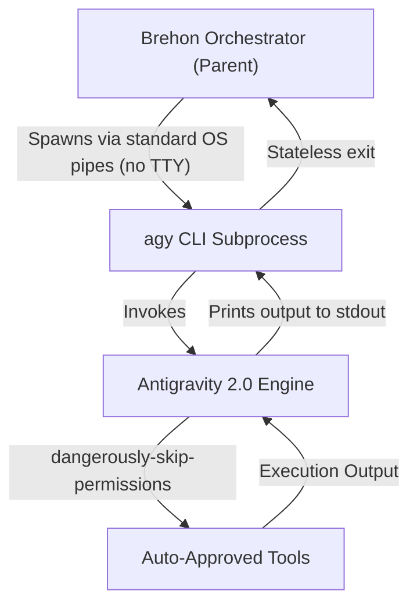
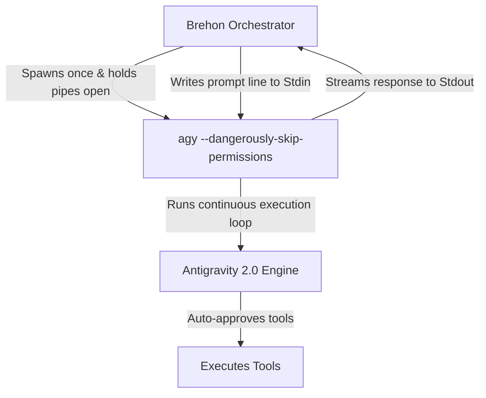
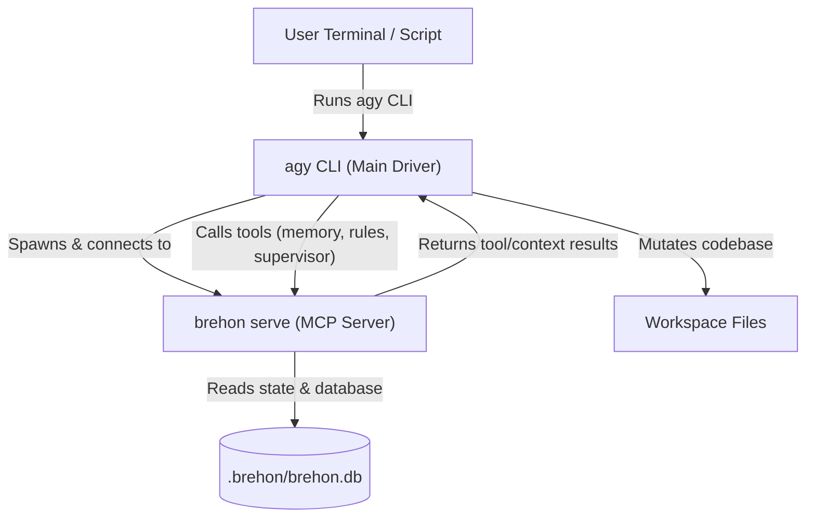

# Integrating Antigravity 2.0 CLI (`agy`) with Brehon

This document provides the research, architecture, and configuration blueprint for integrating Google's advanced closed-source **Antigravity 2.0 CLI (`agy`)** with the **Brehon** agentic framework. 

Since `agy` is closed-source and does **not** support the standard Agent Client Protocol (ACP), we have designed three robust, **PTY-free and sudo-free** integration pathways that accommodate these constraints seamlessly.

---

## 1. Executive Summary & Core Challenges

### The Core Obstacles
1. **No ACP Support**: `agy` replaces the Gemini CLI as Google's agentic workspace terminal interface. It does not speak the JSON-RPC-based Agent Client Protocol (ACP) standard natively.
2. **Interactive TTY / PTY Failures**: Spawning worker processes that allocate an interactive PTY (via `/dev/ptmx` or `/dev/pts`) often fail inside sandboxed environments or containerized parent harnesses unless run with elevated host privileges (`sudo`).
3. **Interactive Prompts & Permissions**: By default, CLI agents halt execution to ask the developer for confirmation on tool execution, breaking headless automation.

### The Solutions
* **TTY-Free Process Spawning**: Spawning subprocesses using standard OS redirected pipes (`stdout`/`stderr`/`stdin` as `Stdio::piped()`) instead of allocating interactive terminal PTY lines. This avoids `sudo` and permission boundary errors entirely.
* **Non-Interactive Automation Flags**: Utilizing `agy`'s native `--print` for one-shot turns, or launching the interactive CLI with `--dangerously-skip-permissions` and no initial prompt so Brehon can deliver real tasks later.
* **Stateless vs. Long-Running Processes**: Supporting both short-lived conversation resumes and long-running stream-driven interactive loops.
* **Reverse-Drive MCP Model**: Running Brehon as an MCP server (`brehon serve`) and letting `agy` drive workspace modifications as the active terminal agent.

---

## 2. Architectural Pathways

We have established three distinct, highly flexible pathways to integrate `agy` with Brehon.

```carousel
### Pathway A: Headless Child Adapter (Brehon-Driven, Stateless)
In this mode, Brehon acts as the orchestrator and spawns `agy` as a short-lived subprocess for each turn.



> [!NOTE]
> Brehon manages session state across separate turns by passing `--conversation <id>` to resume the thread context in a stateless process cycle.

<!-- slide -->

### Pathway B: Long-Running Headless Subprocess (Brehon-Driven, Continuous)
In this mode, Brehon spawns `agy` once as a long-running background process, keeping stdin/stdout pipes open.



> [!TIP]
> This matches the exact operational lifecycle of the rest of Brehon's long-running agents (like Junie) without requiring a PTY or sudo privileges.

<!-- slide -->

### Pathway C: Reverse-Drive MCP (Agy-Driven)
In this mode, the user runs `agy` directly, and Brehon operates in the background as an MCP tool provider.



> [!NOTE]
> This pattern requires zero changes to the Brehon core runner and fully leverages `agy`'s native support for standard Model Context Protocol servers.
```

---

## 3. Pathway B: Long-Running Headless `agy` Subprocess Design

To satisfy the requirement of having `agy` run as a long-running background process (similar to Junie), the adapter spawns a persistent subprocess using redirected OS pipes:

### 1. Spawning the Subprocess
Brehon's `AgentProcess` should spawn `agy` with `--dangerously-skip-permissions` plus the same role startup prompt used by the other CLI workers. The prompt is delivered with `--prompt-interactive <startup prompt>` so Agy registers with Brehon, reports readiness to its supervisor, and then waits for assigned work.

```rust
use std::process::Stdio;
use tokio::process::Command;

let mut child = Command::new("/path/to/agy")
    .args(&[
        "--dangerously-skip-permissions", // Bypass permission prompts
        "--sandbox",                      // Optional: enforce sandbox limits
    ])
    .stdin(Stdio::piped())
    .stdout(Stdio::piped())
    .stderr(Stdio::piped())
    .spawn()?;
```

### 2. Communicating via Stdin/Stdout Stream
Brehon maintains the session's read/write loops just like `JunieSession`:

* **Sending Prompts**: Writes instructions directly to the stdin pipe, terminated by a newline.
* **Receiving Output**: A background `tokio::spawn` loop monitors the stdout pipe, accumulating lines until it detects a complete turn output or marker.

```rust
pub struct AgySession {
    session_id: SessionId,
    process: Arc<AgentProcess>,
    output: Arc<tokio::sync::Mutex<String>>,
    alive: std::sync::atomic::AtomicBool,
}

impl AgySession {
    pub async fn send_prompt(&self, prompt: &PromptTurn) -> Result<(), AgyError> {
        self.process
            .send_line(&prompt.content)
            .await
            .map_err(|e| AgyError::Io(e.into()))
    }
}
```

---

## 4. Pathway C: MCP Reverse-Drive Pattern

If you prefer to make **`agy` the primary driver** of the development process (running tasks from your active terminal), you can reverse-drive the integration:

1. **Brehon MCP Server**: Brehon provides `brehon serve` which launches an MCP server over stdio exposing its underlying events, task directory, memories, and rules.
2. **Setup the MCP Configuration**: Brehon (via the Agy adapter and `brehon run` scaffolding) writes/updates a project-local `.agents/mcp_config.json` inside the workspace (or each worker worktree), which is Antigravity CLI's dedicated workspace MCP config path. This is distinct from Claude Code's `.mcp.json`. The file is machine-local (absolute `brehon` path + `cwd`), so Brehon auto-ignores it and copies it into isolated worktrees. The `agy` adapter always preserves any pre-existing `mcpServers` entries (e.g. other tools) while adding the `brehon` server entry:

   For `agy`, prefer Brehon's default external worktree root instead of
   storing agent worktrees under `.brehon/worktrees/`. External roots prevent
   Antigravity's git-aware workspace discovery from treating the whole checkout
   as hidden or ignored. The default paths are:

   - macOS: `~/Library/Application Support/brehon/worktrees/<repo-name-hash>/`
   - Linux: `$XDG_DATA_HOME/brehon/worktrees/<repo-name-hash>/` or
     `~/.local/share/brehon/worktrees/<repo-name-hash>/`

   Set `orchestration.worktree_root` to an absolute path only when you need a
   fixed location.

```json
{
  "mcpServers": {
    "brehon": {
      "command": "brehon",
      "args": ["serve"],
      "cwd": "/path/to/current/workspace"
    }
  }
}
```

3. **Run Agy**: When Brehon spawns `agy`, the child process inherits the Brehon role and project-root environment. Agy then starts `brehon serve` from the configured MCP entry and exposes Brehon's tools as direct MCP tools such as `agent`, `task`, `factory`, and `verification`.
4. **Result**: `agy` can now call Brehon's tools, search the memories, query supervisor tasks, and request reviews without needing any ACP interface or complex PTY configurations. The role startup prompt follows the same Brehon worker/supervisor/reviewer protocol as other supported CLIs.

---

## 5. Integration Configurations

To register the long-running `agy` worker lane in Brehon, apply the following edits to your `.brehon/config.yaml`:

### 1. Register the `agy` Launcher
Add `agy` under your list of launchers in `.brehon/config.yaml`. Use the dedicated `Agy` adapter for Antigravity 2.0 CLI workers (long-running headless stdio, PTY-free).

```yaml
launchers:
  agy-cli:
    adapter: Agy
    command: /path/to/agy
    args:
      - "--dangerously-skip-permissions"
```

### 2. Configure the Worker/Reviewer Lanes
Define your lanes to leverage the new `agy` launcher:

```yaml
lanes:
  agy-worker:
    launcher: agy-cli
    model:
      provider: google
      name: antigravity-2.0
  agy-reviewer:
    launcher: agy-cli
    model:
      provider: google
      name: antigravity-2.0-reviewer
```

### 3. Assign Roles
Assign `agy-worker` and `agy-reviewer` to your agent pools in `.brehon/config.yaml`:

```yaml
roles:
  workers:
    - lane: agy-worker
      min: 1
      max: 3
  reviewers:
    - lane: agy-reviewer
      min: 1
      max: 2
```

---

> [!IMPORTANT]
> The **Long-Running Headless Subprocess** pattern enables seamless parity with Junie and other long-running agents in your system. By utilizing standard redirected OS pipes (`Stdio::piped()`), `agy` runs robustly without requiring high-privilege pseudo-terminals (PTYs), resolving the `sudo` requirement entirely.
